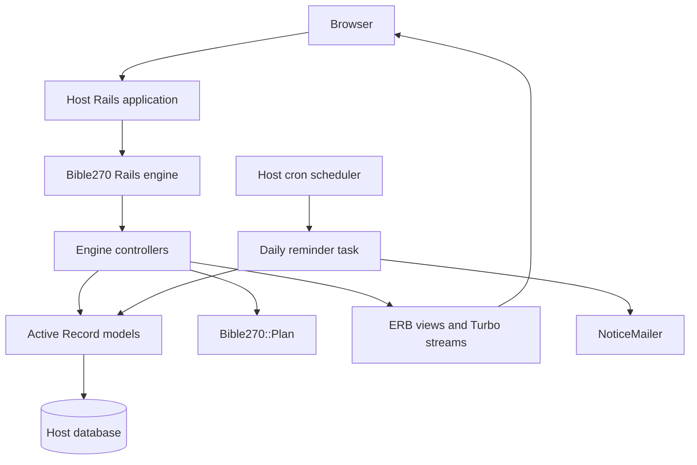
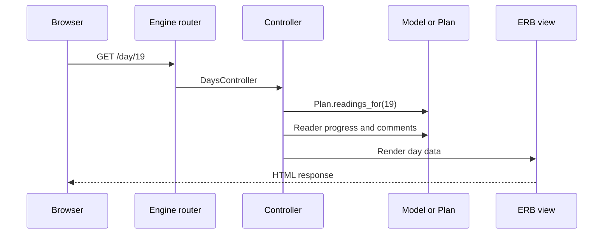

# Bible270 Architecture Walkthrough

This guide explains how Bible270 works from application boot through reader interactions, administration, email delivery, and testing. It assumes general familiarity with Rails MVC.

It describes the codebase at version **1.1.7**. When behavior changes, update this document along with the relevant tests and release notes.

## 1. Start with the big picture

Bible270 is a mountable Rails engine, not a complete standalone application. A host Rails application installs the gem, configures it, owns the database migrations, and mounts the engine at a path such as `/daily-bread`.



The central design distinction is:

- The **reading schedule** is deterministic Ruby generated by `Bible270::Plan`; it is not stored in the database.
- **Participation state** is stored: readers, checkoffs, reflections, replies, likes, settings, and sign-in tokens.

That separation lets every installation generate the same plan while storing only local community activity.

## 2. How the engine boots

The public entry point is `lib/bible270.rb`. It requires the plan and support modules, configuration, reminders, and—when Rails is present—the engine itself.

It also defines Bible270's clock:

- `Bible270.today` returns the plan's current local date.
- `Bible270.local_time(time)` converts timestamps for display and scheduling.
- `Bible270.config.time_zone` overrides the machine's local zone when configured.

`lib/bible270/engine.rb` defines an isolated engine:

```ruby
class Bible270::Engine < ::Rails::Engine
  isolate_namespace Bible270
end
```

Isolation gives the engine its own controllers, models, route helpers, and table namespace without colliding with similarly named host classes.

The engine deliberately does not append its migrations directly to the host's migration paths. The host copies them with:

```sh
bin/rails bible270:install:migrations
```

The host then owns those copied migrations and its schema history.

### Host configuration

`lib/bible270/configuration.rb` defines `Bible270.configure` and `Bible270.config`. Its settings cover:

- Host integration: parent controller, layout, and a custom current-reader resolver.
- Mounting and authentication paths.
- OmniAuth and passwordless email sign-in.
- Remembered sessions and enrollment state.
- Shared and optional personal plan start dates.
- Admin authorization.
- Bible translation and Scripture provider choices.
- Mail delivery and daily reminders.
- App name, header, footer, favicon, and other presentation details.

The installer at `lib/generators/bible270/install/install_generator.rb` creates the host initializer, copies migrations, adds the mount route, and optionally configures Active Storage and authentication providers. Its initializer template is `lib/generators/bible270/install/templates/bible270.rb.tt`.

## 3. Follow an HTTP request through Rails

The engine routes are all in `config/routes.rb`. The major reader-facing destinations are:

| Destination | Controller action | Purpose |
|---|---|---|
| `/` | `DaysController#index` | Home overview and progress |
| `/day/:day` | `DaysController#show` | One day's readings and reflections |
| `/progress` | `ReadersController#progress` | Signed-in reader's progress |
| `/community` | `ReadersController#index` | Community directory |
| `/readers/:id` | `ReadersController#show` | Public reader page |
| `/reflections` | `CommentsController#index` | Reflection conversations |
| `/profile` | `ProfilesController#edit` | Reader preferences |
| `/sign_in` | `SessionsController#new` | Sign-in choices |
| `/admin` | `AdminController#index` | Operational administration |

Every engine controller inherits from `app/controllers/bible270/application_controller.rb`. That controller:

1. Inherits from the host-configured parent controller.
2. Uses the configured layout.
3. Resolves `current_reader` from the built-in session or a host callback.
4. Exposes shared helper methods to views.
5. Enforces sign-in where required.

A typical request therefore flows as follows:



## 4. How the 270-day plan is generated

`lib/bible270/plan.rb` is the schedule engine. Canonical chapter and verse data comes from `lib/bible270/versification.rb`.

Important concepts include:

- `Plan::DAYS`: 270 plan days.
- `Plan::OT`, `Plan::NT`, and `Plan::PP`: the three tracks.
- `Plan::TRACKS`: all available tracks.
- `Plan::CHAPTER_BREAKS`: intentional verse-level chapter divisions.

The tracks are generated differently:

1. **Old Testament:** Psalms and Proverbs are excluded. Whole chapters are grouped into 270 contiguous portions balanced by verse count.
2. **New Testament:** 260 chapters become 270 readings by dividing selected long chapters into verse ranges.
3. **Psalms and Proverbs:** both books are divided and interleaved to fill one 270-day track while keeping sections of a split chapter consecutive.

The principal API is:

- `Plan.readings_for(day)`
- `Plan.parts_for(day, track)`
- `Plan.part_count(day, track)`
- `Plan.total_parts(day)`
- `Plan.valid_day?(day)`
- `Plan.valid_part?(day, track, part)`
- `Plan.date_for(day, start_date)`
- `Plan.day_for(date, start_date)`

A multi-chapter Old Testament reading has one checkoff part per chapter. The New Testament and Psalms/Proverbs readings have one part per daily reading. Completion code therefore uses `Plan.total_parts(day)`, not an assumption that every day has only three checkboxes.

Chapter breaks can come from the built-in constant, configuration, or a YAML path. `Plan.reset!` clears memoized derived values after configuration changes.

## 5. How readers and progress are stored

The main persistence model is `app/models/bible270/reader.rb`. A reader owns:

- Checkoffs.
- Reflections and replies.
- Likes.
- An optional Active Storage avatar.
- An optional polymorphic owner supplied by the host application.
- Identity, translation, notification, reminder, and calendar preferences.

`app/models/bible270/checkoff.rb` stores one completed part with:

- `reader_id`
- `day`
- `track`
- Zero-based `part`

A unique database index prevents duplicate checkoffs for the same reader, day, track, and part.

Key progress methods on `Reader` include:

- `checked_counts` and `checked_count`
- `day_status`
- `day_complete?`
- `days_completed`
- `completion_percent`
- `current_day`
- `partial_days`
- `remaining_parts_for`
- `mark_day_complete!`
- `clear_day!`
- `toggle_day!`
- `mark_through!`

`Reader.completed_days_by_id` performs an aggregate, chapter-aware calculation for lists that need many readers' completion counts. The Community controller calls it only for admins, avoiding an unnecessary query and avoiding competitive reader-facing presentation.

### Toggling a reading

The checkbox route reaches `CheckoffsController#toggle` in `app/controllers/bible270/checkoffs_controller.rb`.

The action:

1. Requires a signed-in reader.
2. Validates the day, track, and part against `Bible270::Plan`.
3. Adds or removes the exact checkoff.
4. Starts an undated reader when their first checkoff is added.
5. Clears relevant progress memoization.
6. Responds with Turbo Stream updates or an HTML redirect fallback.

`app/views/bible270/checkoffs/toggle.turbo_stream.erb` updates only the affected portions of the page: the reading control, day progress, and completion information. The page does not need a full reload.

## 6. How dates and “today” work

Plan history is keyed to plan day numbers, not calendar dates. Changing a start date remaps the calendar without moving checkoffs or reflections.

The shared start date resolves in this order:

```text
Bible270::Setting run-start override
        ↓ fallback
Bible270.config.start_date
```

`app/models/bible270/setting.rb` stores the administrator's current-run override. The Admin panel sets or resets it through `AdminController#update_run_start` and `#reset_run_start`.

`Reader#effective_start_date` then decides the date for one reader:

- When personal start dates are enabled and the reader has `started_on`, that personal date wins.
- Otherwise the shared current-run date applies.
- A nil result means the reader is using an undated plan.

Related `Reader` methods include:

- `calendar_day` and `raw_calendar_day`
- `today_day`
- `date_for_day`
- `plan_end_date`
- `not_started_yet?`
- `past_end_date?`
- `days_off_pace`
- `restart_on!`
- `set_start_date!`
- `ensure_started!`

This design is why an administrator can adjust the run's start date without rewriting anyone's reading history.

## 7. How sign-in works

`app/controllers/bible270/sessions_controller.rb` supports two built-in sign-in paths:

### OmniAuth

The host application's OmniAuth middleware handles the request phase. The engine receives the callback at `/auth/:provider/callback`, finds or creates a reader, resets the Rails session to prevent fixation, and stores the reader ID.

### Passwordless email

`lib/bible270/email_sign_in.rb` normalizes addresses and generates secure random tokens. `app/models/bible270/sign_in_token.rb` stores only a digest, expiration, and consumption state.

The flow is:

1. The reader submits an email address.
2. `SessionsController#email_link` creates a token and sends a magic link.
3. The browser follows that link to `SessionsController#email_callback`.
4. `SignInToken.claim!` atomically consumes a valid, unused token.
5. The controller finds or creates the reader and starts the session.

An encrypted remember cookie can restore a signed-in reader later. `Reader#remember_token!`, `Reader.from_remember_cookie`, and `Reader#forget!` implement that lifecycle.

A host can replace built-in reader resolution with `config.current_reader_resolver`, which is useful when Bible270 shares the host's existing user system.

## 8. How reflections, replies, mentions, and likes work

`app/models/bible270/comment.rb` represents both top-level reflections and one-level replies.

Rules enforced by the model include:

- A reply belongs to a top-level parent.
- A reply and its parent belong to the same plan day.
- Replies do not nest beyond one level.
- A reflection may optionally identify one reading track.
- Hidden reflections are excluded from ordinary public scopes.
- Body length is limited.

`CommentsController` in `app/controllers/bible270/comments_controller.rb` handles listing, creation, editing, and deletion. `Comment.thread_page` paginates conversations as units and orders them by their latest root-or-reply activity.

### Mentions and reply notices

`lib/bible270/mentions.rb` parses handles such as `@first` and `@first.last`. Ambiguous short handles resolve to nobody rather than risking notification of the wrong reader.

After a comment commits, model callbacks determine who should receive a reply or mention notice. They suppress:

- Self-notifications.
- Duplicate reply-and-mention notifications.
- Readers who have opted out.
- Notifications disabled globally.
- Readers already notified for an unchanged mention.

`PlanHelper#b270_with_mentions` escapes all user content and links only successfully resolved mentions.

### Likes

`app/models/bible270/like.rb` stores one row per reader and comment. A unique index enforces that rule. `LikesController#toggle` supports desired-state requests, and its Turbo Stream response replaces only the relevant likes region.

## 9. Community, profile, and Admin responsibilities

### Community

`ReadersController#index` displays readers alphabetically rather than ranking them by progress. Ordinary readers and visitors see identity and joined date. Administrators additionally see a compact completed-day count linked to the Admin reader detail page.

`ReadersController#show` is a public individual reader page with progress, recent approved reflections, and the day grid.

### Profile

`ProfilesController` manages reader-controlled preferences:

- First and last name.
- Avatar.
- Bible translation.
- Bible Gateway or Blue Letter Bible.
- Reply and mention email notices.
- Daily reminder opt-in and time.

Original-language selections use Blue Letter Bible automatically.

### Admin

`AdminController` intentionally concentrates operational features that would clutter the reader experience:

- Open or close enrollment.
- Change or reset the current run's shared start date.
- Inspect and edit readers.
- Manage personal calendar dates where supported.
- Correct exact reading completion state.
- Moderate or delete reflections.
- Remove avatars or readers.
- Send broadcast email.

Unauthorized Admin requests return a routing-style 404 unless Admin support is configured and the current reader passes the configured authorization check.

## 10. How Scripture links are built and opened

Provider behavior is intentionally fixed rather than accepting an arbitrary URL builder:

- Bible Gateway.
- Blue Letter Bible.

The provider list is defined on `Reader`; URLs are generated in `lib/bible270/translations.rb`. Shared link markup comes through `PlanHelper#b270_passage_link`, ensuring all Scripture links use the same behavior.

The no-JavaScript anchor has a named target and `rel="noopener"`. With JavaScript, `app/views/bible270/shared/_interaction_ui.html.erb` coordinates a script-owned reading window:

- Desktop browsers reuse and focus one retained Scripture tab/window.
- iOS/iPadOS Safari closes the previous script-opened reading tab and opens its replacement because Safari does not reliably foreground an existing background tab.
- Modifier clicks remain under normal browser control.

This avoids creating an unlimited series of reading tabs while preserving a secure fallback.

## 11. How mail and daily reminders work

The mailers are:

- `app/mailers/bible270/sign_in_mailer.rb` for magic links.
- `app/mailers/bible270/notice_mailer.rb` for registrations, mentions, replies, reminders, and broadcasts.
- `app/mailers/bible270/application_mailer.rb` for shared sender behavior.

Mailer URLs use `config.mailer_host` and preserve the engine's mount prefix.

### Reminder delivery

The opt-in checkbox only records a preference. The host must schedule the delivery task. `Bible270::DailyReminders.deliver(at:)` in `lib/bible270/daily_reminders.rb`:

1. Checks that reminders are enabled and their schema is available.
2. Converts the supplied time into the configured plan time zone.
3. Selects opted-in readers with email addresses.
4. Checks each reader's selected reminder time.
5. Maps the local date through the reader's effective start date.
6. Skips dates outside the plan and already-completed days.
7. Delivers `NoticeMailer.daily_reminder`.
8. Records `last_daily_reminder_sent_on` only after successful delivery.
9. Isolates one reader's delivery failure from the others.

The task entry point is `lib/tasks/bible270_reminders.rake`:

```sh
bin/rails bible270:reminders:send
```

A typical Docker Compose host polls every 15 minutes:

```cron
*/15 * * * * cd /absolute/path/to/application && /usr/bin/docker compose exec -T rails bin/rails bible270:reminders:send >> /absolute/path/to/application/log/bible270-reminders.log 2>&1
```

Run only one scheduler for each database.

## 12. How the UI is organized

Bible270 keeps its presentation self-contained under `app/views`.

- Main layout: `app/views/layouts/bible270/application.html.erb`
- Shared CSS: `app/views/bible270/shared/_styles.html.erb`
- Header/navigation: `_header.html.erb` and `_nav_links.html.erb`
- Shared progress/grid UI: `_progress.html.erb` and `_day_index.html.erb`
- Shared interaction JavaScript: `_interaction_ui.html.erb`
- Reflection draft JavaScript: `_comment_drafts.html.erb`
- Turbo Stream templates: controller-specific `.turbo_stream.erb` files

The layout uses CSP nonces for inline scripts. JavaScript enhances ordinary forms rather than replacing their server-rendered behavior. Mutation controllers keep HTML redirect fallbacks, while Turbo performs focused updates when available.

The shared interaction code handles:

- Pending, success, and retry status.
- Double-submit prevention.
- Accessible status announcements.
- Turbo submission cleanup.
- Scripture-tab behavior.

The mobile navigation behavior lives with the shared header.

## 13. How settings and migrations are maintained

`Bible270::Setting` is a small database-backed key/value store used for runtime operational state such as:

- Enrollment state.
- Shared run start-date override.
- Last broadcast metadata.

Reader preferences belong on `Bible270::Reader`; operational installation-wide values belong in `Setting` or configuration.

The host owns copied migrations. `lib/bible270/migration_reconciler.rb` and `lib/tasks/bible270_migrations.rake` provide a preview-first repair mechanism for installations where tables exist but Rails migration metadata is incomplete.

## 14. How the test suite works

`test/test_helper.rb` combines pure Ruby unit tests with a dummy Rails application, in-memory SQLite, engine migrations, Active Storage migrations, controller/view/mailer integration, OmniAuth test mode, and SimpleCov.

The test suite verifies:

- Plan and calendar invariants.
- Reader progress and chapter-level checkoffs.
- Authentication and remembered sessions.
- Enrollment and Admin authorization.
- Profiles, reminders, and mailers.
- Reflections, replies, mentions, editing, and likes.
- Turbo responses and HTML fallbacks.
- View, CSS, mobile, and accessibility behavior.
- Install generation, migrations, reconciliation, and packaging.

`bundle exec rake test` defaults to six isolated workers through `parallel_tests`. Each worker has a distinct SimpleCov command name, and the final merged report is written to:

```text
coverage/index.html
```

Override the worker count when needed:

```sh
PARALLEL_WORKERS=4 bundle exec rake test
```

For serial debugging and coverage:

```sh
bundle exec rake test:serial
```

For a fast focused test without coverage:

```sh
SKIP_COV=1 bundle exec ruby -Itest test/some_test.rb
```

The standard validation sequence is:

```sh
bundle exec ruby -Itest test/relevant_test.rb
bundle exec rake test
bundle exec rubocop --cache false
```

## 15. A practical source-reading order

For a guided code review, read these files in order:

1. `bible270.gemspec` — package boundary and dependencies.
2. `lib/bible270.rb` — entry point and plan clock.
3. `lib/bible270/engine.rb` — Rails engine isolation.
4. `lib/bible270/configuration.rb` — host integration and feature switches.
5. `config/routes.rb` — complete HTTP surface.
6. `lib/bible270/plan.rb` and `lib/bible270/versification.rb` — schedule generation.
7. `app/models/bible270/reader.rb`, `checkoff.rb`, and `setting.rb` — progress and calendar state.
8. `app/controllers/bible270/application_controller.rb`, `sessions_controller.rb`, and `checkoffs_controller.rb` — identity and core participation flow.
9. `app/models/bible270/comment.rb`, `like.rb`, and `lib/bible270/mentions.rb` — social domain.
10. `comments_controller.rb` and `likes_controller.rb` — social mutations.
11. `readers_controller.rb`, `profiles_controller.rb`, and `admin_controller.rb` — community, preferences, and operations.
12. `lib/bible270/translations.rb` and `app/helpers/bible270/plan_helper.rb` — Scripture URLs and shared rendering.
13. `lib/bible270/daily_reminders.rb`, the mailers, and reminder Rake task — outbound delivery.
14. The main layout, shared partials, and Turbo templates — UI composition.
15. `test/test_helper.rb`, `Rakefile`, representative integration tests, and `.github/workflows/` — verification and CI.

## 16. Design principles visible in the code

Several project-level decisions connect the architecture to the reader experience:

- **Less is more:** reader pages emphasize the next reading, progress, and community rather than exposing operational controls.
- **Admin density belongs in Admin:** corrections, shared-date management, moderation, broadcasts, and diagnostic information remain available without cluttering ordinary pages.
- **One source of truth:** plan generation, passage links, completed-day aggregation, calendar mapping, and shared controls are centralized.
- **Progress is durable:** changing calendar dates never relocates plan-day checkoffs or reflections.
- **Server behavior works first:** HTML forms and redirects remain valid; Turbo and JavaScript improve speed and feedback.
- **Privacy and safety are explicit:** token digests, session reset, escaped reflection rendering, conservative mention resolution, authorization checks, and secure external-link fallbacks are built into the relevant layers.
- **Installation concerns stay with the host:** the host owns migrations, scheduler configuration, mail transport, mounting, and optional identity integration.

These principles are useful tests for future changes: a feature should make the primary reader task clearer, consolidate rather than duplicate behavior, and place operational complexity in the Admin or host layer whenever possible.
